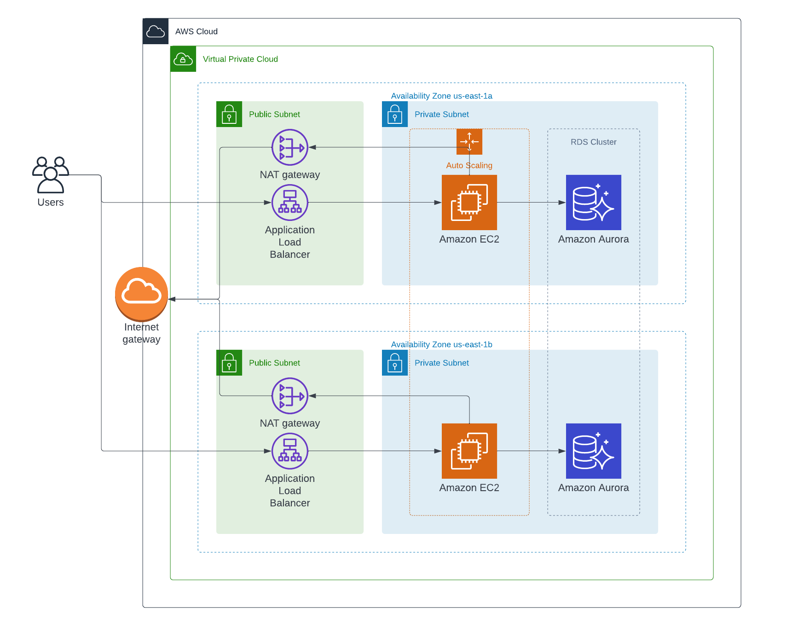

# Assignment-2-CC

These cloudformation templates creates a sample web application designed with production in mind. All levels of the application from Load Balancer, to EC2 instances and Aurora MySQL DB are highly available and redundant. The stacks must be deployed in the order: networking -> server -> storage as each stack references the previous stacks to obtain IDs. 

Security groups only allow traffic from sources that it will be known to come from, for example the Load Balancer accepts port 80 from everywhere, while the EC2 instance only allows port 80 from the ALB security group. The database also only allows connections from the EC2 instance security group.

HTTPS is currently not supported, but if a domain is obtained, an ACM certificate can be used to have a valid certificate.

Sample website is available at http://myser-Appli-1TW20XKJQ5UDT-1522611175.us-east-1.elb.amazonaws.com

## Architecture

## Installation

These documents expect that you are familiar with the AWS console and already have an AWS account.

### Create the Networking stack
- Navigate to the [CloudFormation Home](https://us-east-1.console.aws.amazon.com/cloudformation/home) and click "Create stack", in the drop down click "With new resources"
- Click `Upload a template file`
- Select the `networking.yaml` file in the cloudformation folder of this repository
- Click Next
- Enter a name for the stack, remember it as it will be needed for the next two steps
- Click Next
- Click Next
- Click Create Stack

### Create the Server stack
- Navigate to the [CloudFormation Home](https://us-east-1.console.aws.amazon.com/cloudformation/home) and click "Create stack", in the drop down click "With new resources"
- Click `Upload a template file`
- Select the `server.yaml` file in the cloudformation folder of this repository
- Click Next
- Enter a name for the stack, remember it as it will be needed for the next steps
- Enter in the name for the networking stack created above
- Click Next
- Click Next
- Check the box to acknowledge that IAM resources will be created
- Click Create Stack

### Create the Storage stack
- Navigate to the [CloudFormation Home](https://us-east-1.console.aws.amazon.com/cloudformation/home) and click "Create stack", in the drop down click "With new resources"
- Click `Upload a template file`
- Select the `storage.yaml` file in the cloudformation folder of this repository
- Click Next
- Enter a name for the stack
- Enter in the name for the networking stack created above
- Enter in the name for the server stack created above
- Click Next
- Click Next
- Click Create Stack

### View Web Page
- Navigate to the [Load Balancers](https://us-east-1.console.aws.amazon.com/ec2/v2/home?region=us-east-1#LoadBalancers:sort=loadBalancerName) page of the EC2 console to view the load balancer that was created above
- Click on the Load Balancer named with the same name as the Serer stack
- Copy the DNS name from the panel below and use that to access the web page